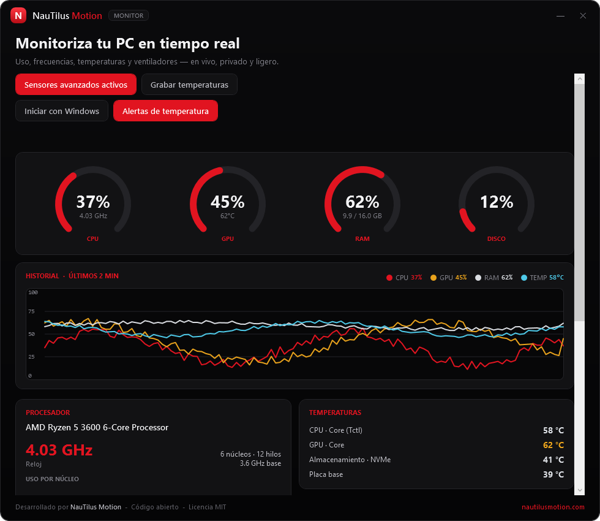

# NauTilus Monitor

**Real-time hardware monitor for Windows 10 and 11 — live, private and lightweight.**

[](https://github.com/nautilusmotion/NautilusMonitor/releases/latest)
[](LICENSE)

### ⬇ [Download the latest release](https://github.com/nautilusmotion/NautilusMonitor/releases/latest)

Unzip and run `NautilusMonitor.exe` — no installer. Keep the bundled `LibreHardwareMonitorLib.dll`
and `HidSharp.dll` next to it so temperatures and fan speeds work. Or [build from source](#build) with
the C# compiler already in Windows.

A free, open-source companion to [NauTilus Optimizer](https://github.com/nautilusmotion/NautilusOptimizer).
Where the Optimizer tunes a PC, the Monitor lets you *see* it: CPU/GPU/RAM/disk usage, live
clock speeds, temperatures and fan speeds — in a single, tiny, no-telemetry app.



## Highlights

- **Single `.exe`, ~200 KB.** No installer and no .NET SDK needed — it uses the C# compiler already
  bundled with Windows. The base app is dependency-free; advanced sensors are an opt-in add-on.
- **Runs without administrator.** Basic monitoring needs no elevation and no driver.
- **No telemetry, no external connections, no third-party libraries** in the base app.
- **6 languages** with a picker at startup: English, Español, Русский, Français, Deutsch, Português.
- **Black & red NauTilus Motion look**, matching the Optimizer.

## What it shows

**Core metrics — read through native Windows APIs, reliable on any language edition:**

- **CPU** total and per-core usage (`NtQuerySystemInformation`) and live effective clock (`CallNtPowerInformation`).
- **RAM** used / total and load % (`GlobalMemoryStatusEx`).
- **Network** download / upload throughput (`NetworkInterface` statistics).
- **System** uptime, process count, OS, motherboard and the hardware overview (via WMI, read once).

**Best-effort in the base app** (they degrade gracefully when the machine doesn't expose them):

- Per-disk activity and read/write throughput.
- GPU load and temperature on NVIDIA cards (via `nvidia-smi`, if the driver is installed).
- An ACPI thermal-zone temperature, when the firmware provides one.

**Advanced sensors (opt-in):** real temperatures for CPU / GPU / motherboard / drives, **fan RPM**,
per-core clocks and voltages. See below.

## Advanced sensors

Reliable temperatures and fan speeds require low-level access that a driverless app cannot provide.
NauTilus Monitor keeps the base app clean and adds these on demand:

1. Click **"Enable advanced sensors"**. The app relaunches elevated (one UAC prompt).
2. It loads [**LibreHardwareMonitorLib**](https://github.com/LibreHardwareMonitor/LibreHardwareMonitor)
   (MIT-licensed) and reads the full sensor tree.

**`build.ps1` fetches this for you.** After compiling, it downloads `LibreHardwareMonitorLib.dll`
and its only Windows dependency `HidSharp.dll` (both MIT) from the official NuGet registry and drops
them next to the `.exe`. If there is no network, the build still succeeds and the app just runs in its
driverless mode. There is **no compile-time dependency** on the library — it is loaded by reflection
only if the DLL is present.

Flags:

```powershell
powershell -ExecutionPolicy Bypass -File build.ps1                     # compile + fetch (cached)
powershell -ExecutionPolicy Bypass -File build.ps1 -RefreshAdvanced    # force re-download
powershell -ExecutionPolicy Bypass -File build.ps1 -NoAdvanced         # skip the download
powershell -ExecutionPolicy Bypass -File build.ps1 -LhmVersion 0.9.4   # pin a version
```

If you ship the `.exe` on its own, just place `LibreHardwareMonitorLib.dll` (and `HidSharp.dll`) beside
it later — the app picks them up with no rebuild.

## Recording temperatures

Click **"Record temperatures"** to log a live session to a CSV. One row per second with the
timestamp, CPU/GPU/RAM load and every temperature sensor (one column each). The file is written to
`Documents\NauTilus Monitor\temperaturas-<date>.csv` using **your Windows list separator and decimal
format**, so it opens cleanly in your Excel (e.g. `;` and comma decimals on a Spanish system). Use
**"Open folder"** to jump straight to it. Recording keeps going while the app is in the background.

## Background (system tray)

**Minimize** sends the app to the notification area (system tray) and it keeps sampling — and
recording — with the window hidden. Double-click the tray icon or its **Show** menu to bring it back;
**Exit** closes it for good. The close (✕) button exits directly.

## Build

No Visual Studio or .NET SDK required. From the repo root:

```powershell
powershell -ExecutionPolicy Bypass -File build.ps1
```

The output is `dist/NautilusMonitor.exe`.

## Tech

- C# on **.NET Framework 4.x** (preinstalled on Windows 10/11), WPF built entirely in code (no XAML).
- All UI text lives in data tables (`src/Loc.cs`), so adding a language is trivial.
- P/Invoke for the language-independent core metrics; `System.Management` (WMI) for the one-time
  hardware overview; reflection bridge to LibreHardwareMonitor for advanced sensors.

## Privacy

The base app makes no network connections and collects nothing. The only optional processes it may
launch are `nvidia-smi` (to read NVIDIA temperature/load) and, in advanced mode, the
LibreHardwareMonitor driver it loads locally.

## License

MIT — see [LICENSE](LICENSE). Developed by [NauTilus Motion](https://nautilusmotion.com).
